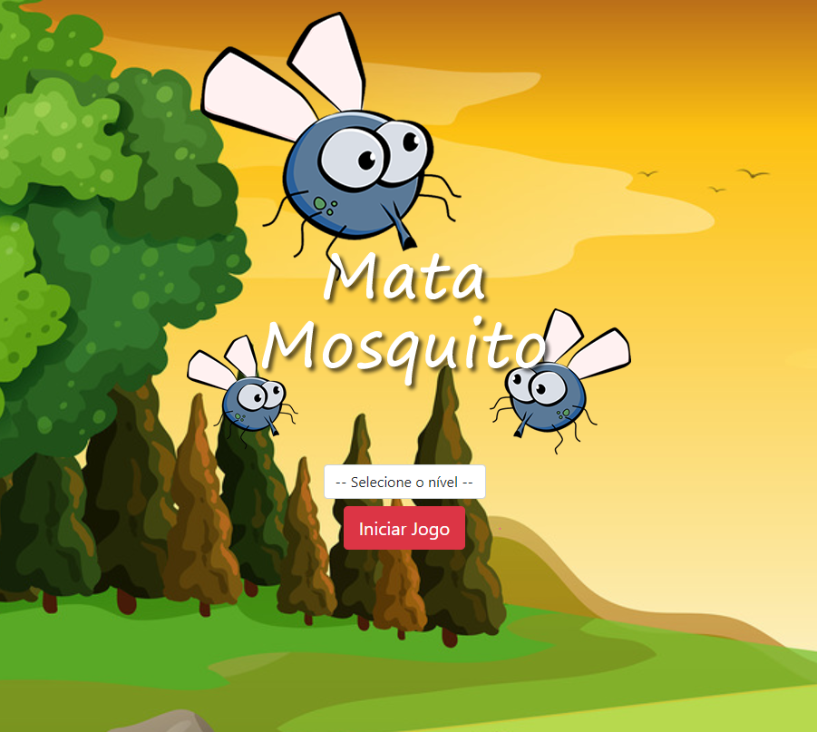
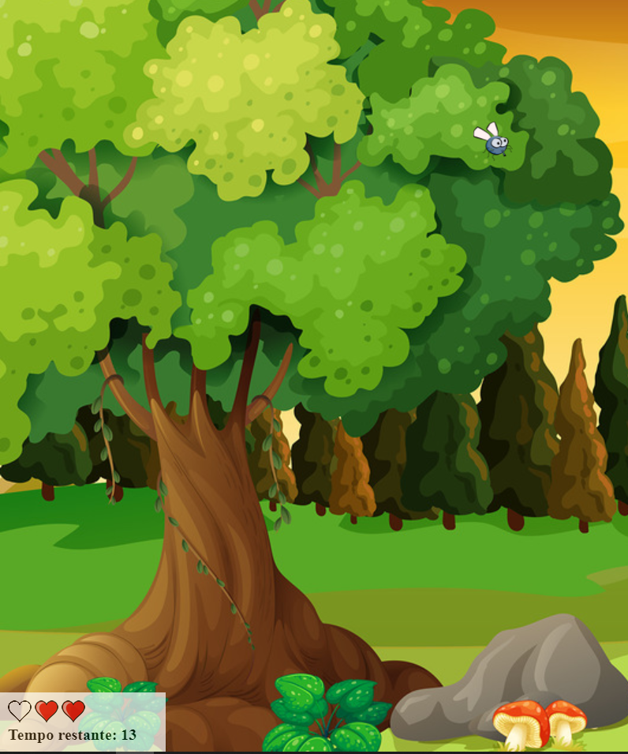

# Licença

# Objetivo
O objetivo em disponibilizar esse código aqui é mostrar o aprendizado adquirido no decorrer do curso.
Mostrando os principais conceitos e recursos que foram apresentados.

# GameMataMosquito
É um projeto de um Game Web desenvolvido em HTML5, CSS3 e JavaScript.
O intuito do jogo é renderizar aleatóriamente imagens de mosquitos em posições diferentes da tela e o
usuário precisa clicar no mosquito antes dele desaparecer, caso falhar lhe custará uma vida.
No game existem 3 níveis de dificuldade e cada nível implica em:
Quanto tempo o mosquito demora pra desaparecer e o tamanho da imagem do mosquito.

# Layout do Game:

# Créditos

- O game é de autoria do professor do curso Jorge Sant Ana
- E foi reproduzido por Fernando Piattelli
